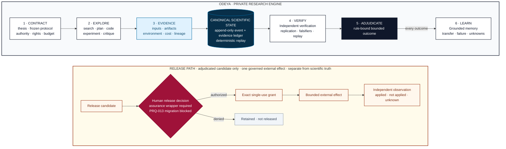

# Odeya

Odeya is a private research engine that turns a thesis into a governed, replayable chain from question to evidence to warranted claim.

> **Current state — 2026-07-22:** architecture foundation only. No executable research engine, autonomous-science capability, production deployment, or automatic publication is claimed. Runtime work remains blocked until the architecture gates are accepted.

The provisional web address is `odeya.danielwahnich.dev`. The apex domain, company, trademark, and scientific-publication decisions remain separate.

## The system in one view

Question → contract → evidence → independent verification → bounded claim. Nothing jumps the chain.



This is the intended control architecture, not a runtime screenshot. Models may propose, search, code, analyze, and criticize. They cannot grant themselves authority, verify their own claims, convert consensus into evidence, or treat a provider response as external truth.

## Five operating laws

1. **Contract before cognition.** Scope, protocol, falsifiers, resources, rights, and authority are explicit before consequential work.
2. **Evidence before narrative.** Every claim traverses to exact inputs, artifacts, environments, costs, methods, and producing activity.
3. **Verification is independent.** Producing and verifying a scientific claim are separate roles, contexts, and retained records.
4. **Nulls and failures are first-class results.** Missing is never zero; blocked, invalid, contradicted, and inconclusive outcomes remain visible.
5. **Every external effect is separately governed.** Publication, repository writes, paid compute, messages, lab actions, and physical actions require exact scoped authority and independent settlement.

## Proof layer

Odeya is being extracted from three active research tracks rather than invented from an abstract agent demo:

| Mission | What it contributes |
| --- | --- |
| **Sentinel** | Measurement discipline, runtime monitoring, failure localization, and bounded transfer claims around autonomous-driving systems |
| **Telos** | External verification, deliberately broken positive controls, correction discipline, and tests of whether benchmark success survives contact with the intended outcome |
| **Inbar** | Physical causal evidence, prospective intervention tests, evidence admissibility, and separation of proposal, safety, execution, truth, outcome, and publication authority |

They are requirements sources and bounded proof missions—not runtime dependencies and not proof that Odeya is already implemented. Their exact role and current limitations are retained in the [proof-layer snapshot](docs/PROOF_LAYER.md).

## Architecture checkpoint

The current retained foundation contains 120 Draft 2020-12 schemas, 860
shared-manifest cases (220 valid and 640 known-bad), 14 isolated contract
suites, 11 architecture-evidence checks, and 7 bounded safe TLA+ models with
30 mutation controls. These counts are bound to the validator run that
measures them; the README previously stated four of them as fact while all four
had drifted.

Those results establish structural and bounded semantic evidence only, and their strength is measured by mutation rather than assumed. The lifecycle checker is audited explicitly: 222 of 229 refusal statements are proved reachable by disabling each in turn, and 108 of 111 removable guard conditions are proved load-bearing (ADR 0052–0054, 0065–0066, 0090); the named residue is retained rather than converted into a flattering completeness claim. That discipline was then generalized to every suite: across 14 declared isolated checker subjects, 469 of 958 refusal statements are proved to fire, with 489 retained explicitly as unproved and zero crash-only detections (ADR 0079–0085). The earlier 431/820 result is retracted: mutation of the self-bound assurance checker invalidated its outer evidence binding, so the audit credited that binding failure rather than the intended guard; the corrected harness refreshes the declared binding only inside each isolated mutation copy and proves its own unrefreshed/refreshed behavior before measuring. Every refusal-attribution claim is checked by a census that fails closed on any unattributed corpus (ADR 0062), and each of the 158 cross-field schema rules with a case is proven to notice its own deletion by two-sided ablation (ADR 0071–0073). Coverage is still not correctness: a proved guard is exercised, not shown to enforce the right rule, structural comparisons count as one condition regardless of field count, and [ADR 0030](docs/decisions/0030-statement-coverage-is-not-condition-coverage.md)'s caution stands — every coverage figure this repository ever published was wrong in the flattering direction until context-isolated adversarial review corrected it, and the corrections are retained.

The PRQ-013 T0 byte-bound/recomputation tranche now retains candidate evidence
under [ADR 0095](docs/decisions/0095-reissue-human-decision-assurance-as-a-byte-bound-independently-recomputed-chain.md):
five unissued successor schemas, seven schema-valid fixtures, 14
content-addressed synthetic backing preimages independently rederived from
their retained bytes, 44 expectation-free vectors, and 49 downstream chain
known-bads. Three
source-separated, non-sharing evaluators produced 132 exact recomputations
(44 each under Python 3.14.2, Node.js 24.18.0, and Temurin Java 21.0.9), and
the comparison binds all six output fields: `participant_id`,
`domain_results`, `categorical_results`, `categorical_failures`,
`final_disposition`, and `reason_codes`. Any fixed times in this evidence are
deterministic fixture times only.
This is stronger bounded defect-detection evidence, not organizational
independence: the implementations share the normative contracts and this work
has not proved organizationally independent authorship or review.

The 0.1 resources remain immutable and unissued, and every successor is also
unissued. The retained eleven-round, context-isolated technical-review report
records `no_grounded_refutation_observed_within_declared_attacks` for the exact
reissued scope only: round eleven reproduced the Gate and generator local Git
readers, corrected PRQ-013 truth bindings, closure, install, cross-runtime, and
full-integration controls. The reissued scope `.0005` is rooted
at `sha256:97062b38a14d5bdccf5ad87c547c62388e7cd82256a445f631856aecee54e1d9`;
closure observation `.0003`, install observation `.0004`, 25 context-review
known-bads including a live generator-path control, and two integration-truth
controls survived only the declared round-eleven checks. The report is
correlated, non-accountable model-worker evidence—not a
`ReviewDetermination`, organizational independence, or Gate A acceptance—and
all `HDA-CTX-001` through `HDA-CTX-016` findings remain pending accountable
closure review.
No real ceremony occurred, no current consumer is migrated, and no T1/T2,
wrapper, end-to-end consumer refusal, accountable review, or operator Gate A
decision is complete. [Gate A remains blocked](docs/ARCHITECTURE_STATUS.md),
with no runtime, cloud, or deployment authority.

The architecture is a modular scientific kernel with isolated cognitive workers around it:

- deterministic state, authority, budgets, lineage, and claim eligibility in the kernel;
- selective model and tool intelligence behind typed work contracts;
- content-addressed evidence and replayable event history;
- separately isolated verification and adversarial adjudication;
- explicit recovery, correction, publication, and external-effect protocols; and
- provider-neutral ports, with infrastructure kept outside scientific meaning.

## Repository boundary

Odeya is independent from Aweb and Maestro in runtime, storage, namespace, control, scientific authority, and release authority. The intended boundary is a private engine, private evaluation suites, and private operating knowledge. Papers, datasets, benchmarks, and mission code may be released mission by mission only through explicit rights, safety, evidence, and publication gates.

This architecture repository is licensed under the [Apache License 2.0](LICENSE); see [CONTRIBUTING.md](CONTRIBUTING.md) and [SECURITY.md](SECURITY.md) for how to engage with it. No domain purchase, company filing, outreach, or product deployment is implied, and runtime, release, and Gate A authority remain exclusively with the repository owner.

## Read the architecture

- [Charter](CHARTER.md)
- [System architecture](docs/ARCHITECTURE.md)
- [Current status and blockers](docs/ARCHITECTURE_STATUS.md)
- [Pre-implementation gates](docs/PRE_IMPLEMENTATION_GATE.md)
- [Research protocol](docs/RESEARCH_PROTOCOL.md)
- [Mathematical constitution](docs/MATHEMATICAL_CONSTITUTION.md)
- [Physical-science constitution](docs/PHYSICAL_SCIENCE_CONSTITUTION.md)
- [Security and authority](docs/SECURITY_AND_AUTHORITY.md)
- [Human decision assurance](docs/HUMAN_DECISION_ASSURANCE.md)
- [Canonical identity and serialization profile](docs/CANONICALIZATION_PROFILE.md)
- [Module ownership and dependency manifest](docs/MODULE_DEPENDENCY_MANIFEST.md)
- [Architecture review protocol](docs/ARCHITECTURE_REVIEW_PROTOCOL.md)
- [Repository release engineering](docs/REPOSITORY_RELEASE.md)
- [Roadmap](docs/ROADMAP.md)

## Reproduce the checkpoint

The architecture validator runs without a development server:

```bash
python3 -m venv .venv-architecture
.venv-architecture/bin/python -m pip install \
  --require-hashes \
  --only-binary=:all: \
  --requirement tools/repository-release/requirements-architecture.lock
.venv-architecture/bin/python scripts/validate.py
```

Repository-release checks lint the workflows and Markdown, validate the README contract, and render the Mermaid map from the exact checked-in block:

```bash
bash scripts/ci/check-repository-release.sh
```

After fetching the digest-verified JAR described in the [formal-model guide](formal/tla/README.md), the bounded models run:

```bash
bash formal/tla/check.sh
```

Which guards have a known-bad proof is measured rather than assumed. The lifecycle checker has its own dedicated statement and condition audits, and every other suite is measured by one generalized audit; both disable each refusal in turn and re-run:

```bash
python3 scripts/audit_lifecycle_guard_coverage.py       # lifecycle statements, ~90s
python3 scripts/audit_suite_guard_coverage.py           # every other suite; duration is machine- and corpus-dependent
```

See [repository release engineering](docs/REPOSITORY_RELEASE.md) for the exact CI jobs, threat boundary, toolchain pins, and fresh-clone rehearsal. A green check is evidence about this repository snapshot; it is never scientific truth or Gate A acceptance.

Repository-governance bootstrap and the first exact-SHA activation were
observed on 2026-07-19. Bootstrap candidate
`a25d026bd7233dfc452accc6087ded0bf015d7b4` remains at its permanent release
ref. Distinct post-account-state candidate
`f1f25fd336daa1dd2707ba36b832e8d5c5e41d3e` then passed all four workflows
and ten jobs at its permanent release ref, was same-SHA promoted to `main`,
passed four new post-main workflows and ten jobs, reproduced from remote
`main`, compared equal by the admitted invariant profile, and settled the
read-only activation receipt. GitHub read-back observed active no-bypass
release and `main` rulesets (IDs `19178198` and `19178503`), disabled pull
requests, the inert rebase-only merge configuration, full-SHA Action admission,
and read-only workflow tokens. The controls remain active but must be freshly
read back for every publication; no descendant inherits `f1f25fd`'s
subject-bound checks, replay, comparison, or activation receipt. None grants
Gate A or runtime authority.

## Next

The canonical-migration wave is closed at audit zero (ADRs 0032–0050): all six blocking finding classes — 1,222 findings in total — now measure zero, every reissue ledgered so each reissued schema's predecessor verifies against its recorded checkpoint commit, and the audit reports `gate_a_disposition: candidate_clear`. The profile nevertheless remains **unissued**: freezing it requires independent review of the executed wave and the operator's exact-byte decision, which no session can grant itself. That executed wave was then attacked across four rounds of context-isolated adversarial review (ADRs 0051, 0063, 0069, 0077), each briefed to refute; each round found real defects — a fabricated disposition field in the evidence writer, a publication path a plain `git push` bypassed, coverage audits that could regenerate their own records — and each is retracted in place with corrected, re-measured figures. Those reviewers were context-isolated but not independent: they shared the producer's provider, model family, and prompt family, five of the twelve correlation axes `ModelConfigurationRecord` already enumerates, and that is recorded rather than glossed (see the [reviewer-agent proposal](docs/REVIEWER_AGENT_PROPOSAL.md)). The ADR 0095 refutation followed the same discipline. T1 `AuthorityAssignment` is the next PRQ-013 downstream tranche only after the four named T0 prerequisites—canonical schema-identity candidate closure, standalone member-record contracts, PRQ-005 through PRQ-010 candidate corrections, and PRQ-013 individual-assurance-foundation candidate closure—are satisfied. The constitutional root/checkpoint/activation chain, independent reducers and verifiers, replay/recovery/correction-fanout evidence, rights-settled proof import, accountable human reviews, an exact candidate manifest, and the owner's exact-byte decision all remain mandatory before Gate A. The [closure plan](docs/GATE_A_PREREQUISITE_CLOSURE_PLAN_2026-07-16.md) and [current handoff](docs/SESSION_HANDOFF.md) retain the dependency order and every open limitation.

Only an accepted Gate A candidate can authorize disposable Gate B probes; one bounded replayable engine slice begins only after a separate Gate C decision.

Autonomy expands after one full chain of custody survives replay, interruption, negative fixtures, recovery, and independent review—not before.
