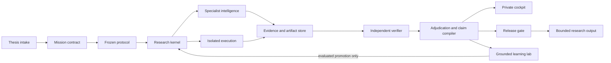
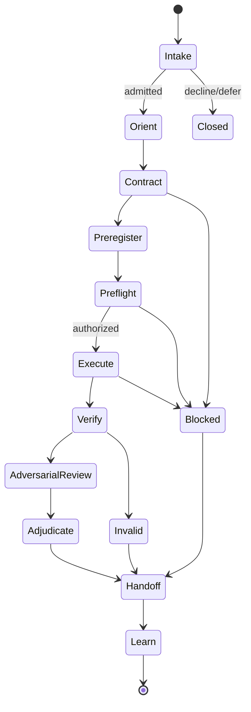
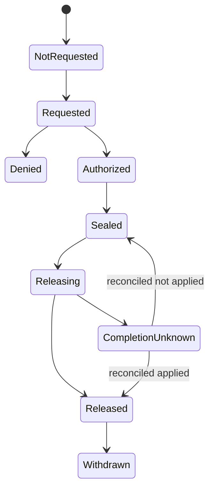

# Odeya Architecture

Status: proposed foundation, 2026-07-15. Components in this document are design targets unless explicitly marked implemented.

## Verdict

Odeya should be an evidence-native scientific operating system: a deterministic, durable research kernel surrounded by replaceable intelligence, tools, compute, and user interfaces.

The kernel must never depend on an agent remembering the mission. It owns the legal state transition, immutable protocol version, work graph, authority, budget, artifact lineage, and claim eligibility. Agents operate inside those boundaries and return proposals or artifacts.



## Architectural invariants

1. One canonical `ResearchMissionSpec` compiles into one immutable `ProtocolSnapshot` and one or more immutable `RunManifest` versions.
2. Canonical state is append-only and replayable. Mutable views are projections, never the only copy of truth.
3. One writer owns each mutable stage. Parallelism is used for decomposable work, not competing mutations of the same state.
4. The generator never supplies the terminal verdict for its own claim.
5. Every consequential transition names its principal, policy, inputs, evidence, and authority.
6. Protocol changes after relevant data exposure create a prospective amendment or fork. They never rewrite the frozen version.
7. Artifact integrity and scientific validity are separate. A correct hash proves identity, not meaning.
8. Retrieval indexes, embeddings, caches, and model context are reconstructible projections.
9. A missing approval fails closed. Timeout and retry exhaustion are not scientific outcomes.
10. Every result remains bounded by the mission's declared claim surface.

## System planes

### 1. Thesis and portfolio plane

Receives internal questions and later external thesis proposals. It records provenance, rights, conflicts, novelty search, feasibility, risk, expected information gain, resource envelope, and a transparent admit/defer/decline decision.

Acceptance means “worth testing under this contract,” not “true” or “absorbed into knowledge.” See [Thesis intake](THESIS_INTAKE.md).

### 2. Research kernel

The kernel is a deterministic transition system. It validates mission contracts, freezes protocols, creates work DAGs, assigns leases, enforces budgets and approvals, persists stage events, handles interruption, and derives the next legal action.

It should expose commands such as:

```text
submit_proposal
compile_mission
freeze_protocol
authorize_stage
lease_work
record_attempt
promote_artifact
request_verification
adjudicate_claim
request_release
record_correction
close_mission
```

Each command validates current state, authority, idempotency key, and referenced digests before appending events. Agents cannot write database rows directly.

### 3. Intelligence and orchestration plane

Models and harnesses are replaceable workers chosen by capability and evaluation record, not permanent personas. Useful roles include:

- literature scout and source-role classifier;
- data or code investigator;
- competing-hypothesis proposer;
- experimental designer;
- implementation worker;
- statistical analyst;
- falsifier and adversarial critic;
- synthesis and claim-drafting worker.

A durable supervisor owns the mission DAG. It may launch parallel workers when branches are independent, especially literature breadth, competing hypotheses, or adversarial search. Sequential planning and state mutation remain centralized.

Multi-agent debate, tournament ranking, and model consensus prioritize candidates. They do not verify truth.

The model-facing boundary is specified in [Cognitive Architecture](COGNITIVE_ARCHITECTURE.md) and [Cognitive Control Contracts](COGNITIVE_CONTROL_CONTRACTS.md). Every role receives an exact exposure-bounded `ResearchStateView`; every material evidence item receives a retained disposition before claim-bearing promotion; generation cannot outrun the separately reserved capacity to verify it. Private chain-of-thought is neither canonical state nor evidence.

### 4. Tool and execution plane

Research actions run through typed capability adapters behind Odeya's own policy gateway. MCP, OpenAPI, CLIs, browser automation, notebooks, simulators, clusters, and laboratories are interoperability mechanisms—not trust boundaries.

Workers are ephemeral and isolated:

- default-deny network;
- no ambient credentials;
- read-only mounted inputs where possible;
- capability-scoped, expiring leases;
- explicit CPU, memory, accelerator, time, token, and spend budgets;
- egress through an audited proxy;
- deterministic environment and dependency capture;
- idempotency and duplicate-charge protection;
- artifact export only through a promotion gate.

Rootless containers are a candidate only for trusted, low-risk fixture workloads after the Phase 1 threat model and escape tests. Arbitrary contributed or model-generated code requires a stronger isolation tier—such as gVisor, Kata, or a microVM—selected against the accepted threat model.

### 5. Evidence and provenance plane

The evidence plane contains:

- an append-only event ledger for research state;
- a content-addressed object store for raw and derived artifacts;
- relational metadata and edges for claims, evidence, activities, agents, versions, and corrections;
- exact Git, dataset, environment, command, model, tool, and evaluator identities;
- W3C PROV-aligned exports and RO-Crate research packages;
- derived text, vector, and graph-search indexes.

PostgreSQL is the provisional transactional-store candidate. An S3-compatible object store is the candidate for immutable blobs. Git preserves reviewed source and protocol-authoring provenance, but an accepted protocol is the canonicalized snapshot whose digest is sealed in the Odeya ledger and whose exact bytes are retained as an artifact. Arrow/Parquet and DuckDB are candidates for local scientific analysis. A dedicated graph database is not justified initially; indexed relational edges and recursive queries are enough until measured workloads say otherwise. Product choices remain provisional until their Gate A contracts and any authorized Gate B probes pass.

See [Evidence and memory](EVIDENCE_AND_MEMORY.md), the [canonical identity profile](CANONICALIZATION_PROFILE.md), and the [ledger integrity and recovery contract](LEDGER_INTEGRITY_AND_RECOVERY.md).

The exact commit/transaction/crash semantics are specified separately in the [transaction and recovery model](TRANSACTION_MODEL.md); that document governs wherever shorthand here could imply cross-system atomicity.

### 6. Verification and adjudication plane

Verification is a different execution identity and isolation boundary from generation. The evidence ladder is:

1. schema, integrity, unit, statistical, and formal checks;
2. clean-environment re-execution;
3. clean-context review with controlled exposure;
4. adversarial critique, preferably using a different harness or model family;
5. independent domain review for consequential claims;
6. independent replication before the `replicated` state.

The adjudicator is a pure derivation over retained facts wherever possible. It emits a machine-readable determination or refusal plus reasons; it does not silently repair failed evidence. Scientific outcomes are only `supported_within_scope`, `contradicted`, `falsified`, `null_result`, or `inconclusive`. Invalidity, blockers, rights, infrastructure, verification, replication, transport, corrections, and publication remain orthogonal records.

### 7. Policy and authority plane

The policy plane resolves who may do what, with which resource, under which contract, for how long. It separates:

| Authority | Question |
|---|---|
| Proposal | What action or hypothesis is worth considering? |
| Protocol | What test is frozen and what would it imply? |
| Safety | May this action be attempted under current controls? |
| Data rights | May these bytes be acquired, processed, exposed, retained, trained on, or disclosed for this purpose? |
| Resource | May this compute, credential, money, or scarce capacity be used? |
| Execution | Which worker may perform the authorized action? |
| Verification | What did retained evidence establish? |
| Outcome | What happened in the external system? |
| Publication | What may be disclosed, to whom, under which wording? |

One human can hold several authorities during the founding phase, but the system records distinct decisions and prevents a worker from implicitly inheriting them. Data acquisition, model exposure, reuse, retention, deletion, and disclosure additionally follow the [data-governance lifecycle](DATA_GOVERNANCE.md).

### 8. Evaluation and learning plane

Every model, prompt, tool, harness, strategy, and workflow change is evaluated against pinned tasks, negative fixtures, private holdouts, cost curves, and replay tests. Production policy changes only after shadow evaluation, independent review, staged promotion, and rollback preparation.

Grounded learning records reproducibility, falsifier coverage, information gain, uncertainty reduction, decision consequence, claim validity, and cost efficiency. A positive result is not intrinsically a positive reward; a decisive null can be more useful.

There is no direct production self-modification path. See [Evaluation and learning](EVALUATION_AND_LEARNING.md).

### 9. Projection and interface plane

The private cockpit renders canonical state without becoming canonical state. It shows the mission contract, protocol freeze, work graph, evidence, bars and falsifiers, authority, compute, uncertainty, corrections, and next legal action.

The later public surface and contribution surface are separate projections with separate authorization and redaction. The engine-side truth/freshness boundary is [Projection Contracts](PROJECTION_CONTRACTS.md); Daniel's product direction remains in [UI/UX](UI_UX.md).

## Mission lifecycle



The scientific lifecycle stages are:

`intake -> orient -> contract -> preregister -> preflight -> execute -> verify -> adversarial_review -> adjudicate -> handoff -> learn`

Release is a separate aggregate governed by the [noncircular publication protocol](PUBLICATION_PROTOCOL.md). It may be requested after adjudication and may proceed, be denied, time out ambiguously, be withdrawn, or be corrected without changing the scientific phase history. `handoff` is mandatory. Interruptions are resumable states, not null findings. Amendments, corrections, and replications form linked prospective branches.



## Canonical objects

The minimum domain model is:

```text
ThesisProposal
ResearchMissionSpec
ProtocolSnapshot
ProtocolAmendment
RunManifest
StageEvent
WorkItem / Attempt / ResourceLease
Artifact / ArtifactDigest / EnvironmentDigest
MetricDefinition / MetricObservation
Falsifier / FalsifierVerdict
ClaimProposal / ClaimVersion / ClaimEvidenceEdge / ClaimCorrection
VerificationRun / Review / Adjudication
Approval / AuthorityGrant / PolicyDecision
PublicationManifest
Handoff
GroundedOutcome / StrategyCandidate / PromotionDecision
```

Every claim must be traversable to the exact evidence, producing activity, code revision, dataset and split, environment, command, evaluator, resource use, verifier identity, and claim boundary.

## Recommended implementation shape

Start as a modular monolith plus isolated workers. This keeps transactions and invariants understandable while preserving service boundaries:

```text
apps/
  cockpit/          private research instrument
packages/
  protocol/         schemas, compiler, amendments, bars, falsifiers
  kernel/           commands, transitions, policy hooks, projections
  provenance/       hashing, evidence/claim graph, exports
  sdk/              provider-neutral capability and mission APIs
services/
  control-plane/    API and durable lifecycle owner
  worker/           isolated task execution
  verifier/         separately isolated recomputation
  indexer/          papers, datasets, repositories, citations
  learning-lab/     offline evaluation and candidate promotion
```

Leading reversible candidates (not frozen products):

| Concern | Candidate | Boundary |
|---|---|---|
| Research runtime | Python | Scientific libraries and agent/tool adapters |
| Cockpit and typed client | TypeScript + Next.js | Projection only; no scientific authority |
| Durable workflows | Temporal | Scheduling and recovery below Odeya's lifecycle semantics |
| Canonical metadata | PostgreSQL | Transactions, events, projections, row-level access |
| Large artifacts | S3-compatible content-addressed store | Immutable blobs, retention and access policy |
| Scientific tables | Arrow/Parquet + DuckDB | Reproducible local analysis and exchange |
| Code and protocol authoring | Git | Exact revisions and reviewable changes; accepted protocol remains a ledger-sealed artifact |
| Policy | OPA or Cedar adapter | Versioned decisions; product choice remains reversible |
| Secrets and signing | KMS/Vault class service | Credentials stay outside workers |
| Observability | OpenTelemetry | `mission -> cycle -> stage -> run -> model/tool call` |
| Provenance export | W3C PROV + RO-Crate 1.3 profile | Interoperable evidence packages |

The first implementation should not require Kubernetes, a graph database, WebGPU, a Rust kernel, or many microservices. Add them only against a measured bottleneck or security need.

The selection/evidence/exit requirements for every row are in [Technology decisions and reversibility](TECHNOLOGY_DECISIONS.md), and logical ownership/import direction is frozen separately in the [module dependency manifest](MODULE_DEPENDENCY_MANIFEST.md). A candidate name here is not Gate A acceptance or implementation authorization.

## Reliability semantics

- Commands are idempotent and carry request IDs.
- Work uses leases, heartbeats, compare-and-set transitions, and stale-lease recovery.
- Retries create attempts; they do not overwrite prior attempts.
- Actual usage is recorded separately from estimates. Unknown usage remains unknown.
- Cross-store promotion follows a recoverable protocol: stage bytes, verify the complete stream and digest, conditionally materialize immutable bytes at the content-addressed key, then commit the artifact-promotion event, metadata, authority/resource effects, aggregate head, command receipt, and outbox in one database transaction. Materialized-but-unregistered bytes are inert orphans. Reconciliation handles every failure boundary; no distributed atomicity is implied.
- Interrupted runs resume from persisted facts with a generated handoff.
- Publication reads a sealed projection tied to an exact ledger position.
- Corrections add a new claim version and correction edge; they do not mutate prior publications.

## Build-versus-adopt rule

Odeya should own scientific semantics, evidence lineage, authority, claim compilation, evaluation, and product experience. It should adopt commodity durability, storage, sandboxing, observability, and cryptography through narrow ports. Replacing a vendor must not change the meaning of a mission or verdict.

## First vertical slice

Use the exact committed composite selected in [the first vertical-slice specification](FIRST_VERTICAL_SLICE.md): Sentinel provides the primary bounded positive and interval-crossing-zero replay, Telos provides correction/replay-discrepancy/invalid-protocol controls, and Inbar provides blocked/refusal/rights controls. The numbered proof that each mission lesson maps to an Odeya contract and a still-visible closure test is [Proof-Mission Requirements Traceability](PROOF_MISSION_REQUIREMENTS_TRACEABILITY.md).

No source bytes enter Odeya until their per-artifact rights decisions and final import manifest settle. The future authorized slice is complete only when it can:

- validate a typed mission contract;
- freeze and hash a protocol;
- schedule one real work DAG under a resource budget;
- survive interruption without conversational memory;
- produce content-addressed artifacts;
- recompute the main metric in a different worker;
- catch deliberately broken inputs;
- compile an eligible bounded claim or an explicit negative outcome;
- render the complete lineage in the cockpit.

That milestone tests the architecture. Adding more agents before it passes would add complexity without establishing scientific reliability.
