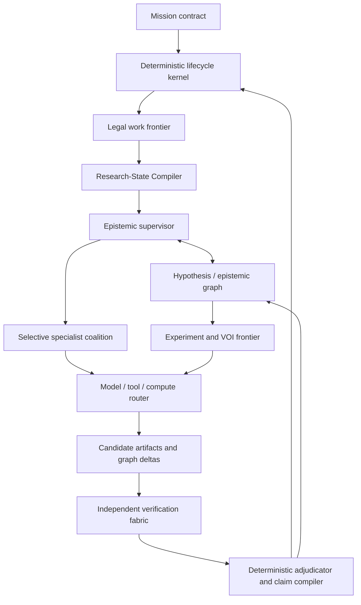

# Cognitive Architecture

Status: proposed, 2026-07-15. This is the model-driven layer inside Odeya; it has no canonical-state, truth, spending, safety, or publication authority.

## Verdict: a dual-loop scientific control system

Odeya should not be “a supervisor agent with a swarm.” It should contain two fundamentally different loops:

1. **Outer deterministic scientific control.** Owns protocol, state, authority, evidence admissibility, budgets, transition legality, and claim eligibility.
2. **Inner model-driven epistemic search.** Proposes hypotheses, plans, experiments, implementations, analyses, critiques, and graph changes.

They communicate only through typed proposals and retained artifacts.



No model, including the epistemic supervisor, owns truth or mission state.

## Formal control abstraction

Let the canonical research state at ledger position `t` be

\[
x_t=\operatorname{fold}(e_{1:t}),
\]

where every `e_i` is an immutable, schema-valid domain event. Given active grants `g_t` and policy version `p_t`, the deterministic kernel exposes only the legal command frontier

\[
\mathcal A_t=\mathcal A_K(x_t,g_t,p_t).
\]

The Research-State Compiler produces an exposure-bounded observation

\[
v_t=C(x_t,r,o,B_c),
\]

for role `r`, objective `o`, and context budget `B_c`, together with a digest and omission manifest. A model configuration `m` samples proposals and artifacts

\[
(\tilde a_t,\tilde z_{t+1},q_t)\sim \pi_m(\cdot\mid v_t,B_m),
\]

where `q_t` is a proof-carrying attempt record and `\tilde z` is only a proposed epistemic-graph delta. The kernel admission function

\[
\Gamma(x_t,\tilde a_t,q_t,g_t,p_t)\in
\{\text{reject},\text{retain-only},\text{commit event batch}\}
\]

is deterministic at its pinned contract version. This creates an intentional asymmetry: generative intelligence may be probabilistic and replaceable; authorization and canonical state change are typed, replayable, and fail closed.

Research is partially observed and the true transition law is generally unknown, so Odeya must not pretend to solve one fully specified POMDP. For a candidate experiment `d`, hard constraints first define

\[
\mathcal D_t=\{d:\text{observable, identifiable enough, authorized, affordable, safe enough, and verifiable}\}.
\]

Within `\mathcal D_t`, planning retains a robust vector such as

\[
J(d)=\big(\underline{I}(d),\underline{V}(d),F(d),
-\overline C(d),-\overline H(d),R(d)\big),
\]

where lower/upper bounds represent information, decision value, cost, and harm uncertainty; `F` is falsification/discrimination power and `R` is reversibility. A declared rule chooses from the Pareto set. Scalar optimization is allowed only when probabilities, utilities, dependencies, and calibration are themselves admissible evidence. Otherwise a human authority selects from the visible frontier with sensitivity analysis.

The controller stops or escalates when the legal frontier is empty, a sealed statistical stop fires, the reserved verification budget would be violated, or the bounded marginal verified value is non-positive. Operational safety stops remain separate from statistical stopping.

## Scientific lifecycle supervisor

This is kernel code, not an LLM. It:

- derives the legal next-stage frontier;
- enforces protocol and exposure state;
- calculates remaining resources and active grants;
- serializes mutable-stage promotion;
- stops on missing evidence, permission, budget, or policy;
- accepts model output only through validated commands and artifact promotion.

It never asks a model whether a transition is legal when the contract can decide it.

## Epistemic supervisor

A replaceable frontier model operates as a receding-horizon planner over one bounded planning epoch. It receives a compiled research view at an exact ledger position.

It may:

- surface contradictions and unresolved questions;
- maintain competing explanations;
- request specialist branches;
- propose experiments, analyses, and resource allocations;
- recommend stop, replan, fork, or escalate.

It may not:

- write canonical state;
- assign itself authority or verifier identity;
- access sealed truth outside its exposure policy;
- amend a frozen protocol;
- declare support, safety, value, or completion;
- turn consensus into evidence.

A context crash loses no scientific state. The next epoch compiles from retained facts.

## Epistemic model graph

Call it an epistemic graph rather than a world model: it represents current propositions and their evidence, not reality itself.

### Evidence stratum

Immutable observations, artifacts, sources, methods, activities, environments, metric results, and verifier packages.

### Epistemic stratum

Hypotheses, mechanisms, variables, assumptions, expected observations, rival explanations, contradictions, residual unknowns, and scoped claim versions.

### Planning stratum

Candidate experiments, interventions, analyses, observability/identifiability, predicted observations by hypothesis, evidence expected, costs, risks, authorities, and stop rules.

A hypothesis object contains:

```text
id + immutable version
claim type and scoped proposition
population / context / environment / time
variables, units and coordinate frames
mechanism or structural model
assumptions and explicit discrepancy/unknown class
rival and compatible hypotheses
prior distribution/range or "not modeled"
predictions under candidate interventions
falsifiers and claim consequences
evidence dependencies and shared-evidence groups
uncertainty channels
provenance and exposure state
lifecycle
```

Rules:

- Never store generic confidence.
- Priors and likelihoods exist only under a coherent declared model.
- Preserve “model set incomplete” as a live alternative.
- Never multiply evidence measures with unmodeled shared dependencies.
- Merge hypotheses only when variables, units, frames, interventions, and scope are compatible.
- Low model-ranked plausibility cannot delete an alternative.
- Model output produces a proposed graph delta; evidence and adjudication produce eligible claim changes.

Core relations include `predicts`, `explains`, `tests`, `falsifies`, `supports`, `contradicts`, `depends_on`, `shares_evidence_with`, `confounded_by`, `identified_by`, `incompatible_with`, `refines`, `replicates`, `transports_to`, and `supersedes`.

Typed relational tables are sufficient initially. Graph semantics do not require a graph database.

## Research-State Compiler

The compiler is a central proposed Odeya contribution. It deterministically transforms canonical state into the minimum role- and exposure-specific model view:

```text
compile_state(
  mission_ref,
  protocol_ref,
  ledger_position,
  role_contract,
  work_objective,
  context_budget,
  exposure_policy
) -> ResearchStateView
```

The view contains:

```text
view and canonical context digest
mission question and permitted claim surface
relevant epistemic subgraph
competing hypotheses and model-incompleteness state
known unknowns and unresolved contradictions
required evidence, controls, and falsifiers
legal actions and remaining resource envelope
exact artifact references and freshness
omitted-context manifest
output schema and forbidden actions
```

Compilation:

1. includes constitution, frozen protocol, and task-required state;
2. traverses exact evidence and hypothesis dependencies;
3. retrieves additional candidates from disposable indexes;
4. ranks within the role's context budget;
5. checks contradiction, source-role, and required-evidence coverage;
6. seals the view and omission manifest.

Generators never receive sealed evaluator truth. Verifiers receive the protocol and required evidence without automatically receiving the producer's persuasive narrative. Retrieval choices remain replayable, and a summary never becomes more authoritative than its sources.

## Specialist coalition

Specialists are versioned evaluated capabilities—not named personalities:

- broad literature scout;
- deep source and citation verifier;
- prior-art and novelty mapper;
- hypothesis generator and normalizer;
- experimental-design/statistical specialist;
- causal-identification critic;
- data-analysis and implementation worker;
- simulation and scorable-search worker;
- transfer/replication critic;
- adversarial falsifier;
- reproducibility specialist;
- safety, rights, and disclosure reviewer;
- synthesis and claim-drafting worker.

Coalition topology follows task structure:

```text
independent breadth          -> parallel map/reduce specialists
shared-state sequential work -> one owner with checkpoints
objectively scorable search  -> bounded tree/evolution engine
high-consequence judgment    -> specialist proposal + human authority
```

Each worker receives a `WorkContract` and returns a `CandidateArtifact` containing objective, context digest, method/tool identities, artifacts, proposed graph deltas, assumptions, uncertainty, resource use, limitations, and failure state.

Agents exchange artifact references and graph deltas by default, not unstructured private conversations. Every worker receives a correlation-group label because model or prompt diversity does not establish scientific independence.

## Experiment and value-of-information frontier

An experiment candidate specifies:

```text
intervention or analysis
predicted observation under every relevant hypothesis
measurement and sampling design
expected discriminating evidence
observability and identifiability
direct and opportunity cost
risk, reversibility, and harm
required authority and physical/data access
verification oracle
stop and continuation conditions
```

Hard reject candidates that are unobservable, non-identifying, unable to separate hypotheses, unsupported by the measurement system, outside authority/risk, or incapable of admissible evidence.

Where calibrated probabilistic and utility models exist, use the decision-theoretic contract in the [mathematical constitution](MATHEMATICAL_CONSTITUTION.md). Otherwise preserve falsification power, information, decision relevance, feasibility, cost, time, risk, and diversity as a visible vector; form a Pareto frontier and apply a human-authorized decision rule with sensitivity analysis.

Never manufacture quantitative VOI from arbitrary LLM probabilities.

Exploratory planning may adapt within its budget. Confirmatory planning adapts only through the sealed sequential design. Exploratory discoveries create prospective protocols.

## Model, tool, and compute router

No model name is constitutional. Each evaluated configuration records:

```text
provider / model / version / region
harness and context policy
structured-output and tool capabilities
allowed data classes and retention policy
role-specific capability surface
cost / latency / reliability curves
known failure modes and validity period
correlation group
```

Routing first applies hard admissibility:

- modality and tool need;
- data sensitivity and residency;
- risk and safety qualification;
- latency, context, and structured-output requirements;
- independence and provider constraints;
- exact model identity and retention behavior.

Then select from a Pareto frontier of expected verified performance, cost, latency, failure/safety risk, and human intervention.

Role policy:

- strongest measured reasoning configuration for hard supervision/synthesis;
- efficient diverse configurations for exploratory breadth;
- best evaluated code/data configuration for executable work;
- deterministic scientific adapters before model improvisation;
- different family/provider for model-assisted critique where it improves the actual independence vector;
- no model for deterministic adjudication.

A provider fallback is a new attempt. It never silently changes a confirmatory run.

## Test-time compute controller

Budget is allocated across breadth, depth/evolution, implementation, verification, adversarial testing, and replication reserve. Verification capacity is reserved before generation.

Rules:

- parallel samples create exploratory diversity, not votes on truth;
- tree/evolution/UCB search is permitted only with a sealed, red-teamed executable scorer;
- every best-of-N selection is recorded for multiplicity and selection accounting;
- stop at the declared budget, stop rule, lack of admissible action, or insufficient marginal verified value;
- report capability as a budget surface.

Google ERA and AlphaEvolve support this pattern for objectively scored work; they do not justify it for novelty, causality, safety, or research taste.

## Verification fabric and adjudication

Verification is heterogeneous infrastructure, not one critic persona:

```text
integrity/schema
  -> registered deterministic/statistical evaluator
  -> known-bad controls
  -> clean-environment re-execution
  -> independent implementation/tool where needed
  -> clean-context adversarial review
  -> external expert/instrument/testbed/replication
```

A verification package reports artifact integrity, computational reproducibility, method/statistical validity, calibration, causal identification, external validity, scope/transport, safety-case status, discrepancies, counterexamples, and the multidimensional independence vector.

Model critics create findings. They do not settle claims through agreement.

The pure adjudicator consumes the protocol, evidence manifest, verifier packages, and unresolved findings. It emits separate validity, scientific verdict, eligible/forbidden language, remaining uncertainty, correction/replication requirement, and next legal action. If the protocol cannot derive a verdict, it returns indeterminate or invalid.

## Long-horizon memory

Six layers remain separate:

1. immutable mission event ledger;
2. content-addressed artifacts;
3. versioned epistemic graph;
4. generated checkpoint/handoff packets;
5. disposable search and context indexes;
6. grounded cross-mission strategy registry.

Private reasoning and scratchpads are ephemeral and noncanonical. Durable memory carries origin, ledger position, evidence/activity references, validity/supersession, sensitivity/visibility, applicability, and freshness.

Memory promotion is:

```text
model observation
  -> candidate memory
  -> evidence linkage
  -> verification
  -> applicability review
  -> mission or strategy memory
```

## Learning lab

The quarantined lab can propose changes to model routing, context compilation, topology, prompts, harnesses, search, tool descriptions, experiment heuristics, retrieval, and stopping. It cannot directly change the constitution, kernel, policy, evaluator, production memory, or claim compiler.

Use development, validation, and sealed outer holdout partitions. Promotion is verified outcome -> candidate -> offline replay -> matched-budget holdout -> independent review -> shadow -> bounded canary -> human decision.

Production missions are not uncontrolled contextual-bandit experiments.

## Proof-project adapters

- **Sentinel:** measurement, paired experiments, failure localization, simulation boundary, positive in-domain result, and transfer null. Best first test of state compilation and claim bounding.
- **Telos:** execution-grounded success, reward/grader hacking, known-bad controls, protocol leakage, and corrections. Primary test of verification and evaluator integrity.
- **Inbar:** evidence admissibility, competing mechanisms, measurement/causal assumptions, prospective testbeds, sealed truth, and physical authority. A confident diagnosis from its current blocked substrate would be an Odeya failure.

They enter as pinned benchmark/mission adapters, never merged repositories or training data.

## What is proposed as distinct

Supervisors, specialists, tree search, evolutionary archives, world models, durable logs, and lab loops all have precedent. Odeya's proposed contribution is the composition:

1. deterministic scientific authority separated from epistemic model search;
2. evidence-governed epistemic graph with contradictions, dependencies, exposure, and claim state;
3. deterministic role-specific Research-State Compiler;
4. experiment selection separating information, value, cost, harm, and falsification;
5. proof-carrying artifacts, independent verification fabric, and claim compiler;
6. topology/model selection based on matched-budget evidence;
7. corrections and negative outcomes feeding future evaluation;
8. one contract spanning computational measurement, adversarial verification, and physical causality.

These are architecture hypotheses—not yet proven novelty or superiority.

## Architecture falsifiers

- If the graph does not improve contradiction retention or long-horizon validity per cost, defer it.
- If specialists do not beat one model under matched budgets, use one model.
- If quantitative VOI is uncalibrated, retain a transparent Pareto/human rule.
- If provider diversity does not reduce independent error, do not pay for it.
- If adaptive compute raises benchmark score but worsens false claims or transfer, reject it.
- If the state compiler omits required contradictory evidence, no compiled context can authorize confirmatory work.
- If the verifier fails any declared known-bad fixture, no claim becomes eligible.

## Matched-budget ablation ladder

```text
B0 deterministic/manual current practice
B1 one frontier model + tools
B2 one model + state compiler/epistemic graph
B3 supervisor + specialists, flat memory
B4 supervisor + graph + selective specialists
B5 B4 + experiment frontier planner
B6 full architecture + verification fabric
```

Measure false eligible-claim rate, verified uncertainty reduction, independent reproducibility, falsifier/confound discovery, claim-boundary compliance, cost and human time per verified result, correction latency, authority/safety violations with upper bounds, error accumulation/recovery, and expert usefulness.

Required ablations include graph versus flat notes, compiled context versus full ledger, one model versus coalition, one provider versus heterogeneous routing, greedy versus VOI/Pareto experiments, fixed versus adaptive compute, browser improvisation versus deterministic adapter, self-review versus independent verification, and unfiltered versus verified learning.

## Cognitive dependency order

1. Freeze hypothesis, experiment, state-view, candidate-artifact, verification, and adjudication contracts.
2. Validate deterministic state compilation on one pinned Sentinel replay.
3. Establish one model, one planner, and deterministic verification as the baseline.
4. Add the epistemic graph and beat flat memory on retained contradictions and cost.
5. Add only literature/falsifier specialists that beat the matched single-model baseline.
6. Add ERA-like search only for bounded executable scorers.
7. Add router policies from retained role-specific evaluations.
8. Add Inbar-style causal/testbed planning without physical authority.
9. Add quantitative VOI after calibrated outcome, cost, and decision data exist.
10. Add the learning lab only after multiple independently verified missions.

## Primary evidence

- [Google Co-Scientist](https://deepmind.google/blog/co-scientist-a-multi-agent-ai-partner-to-accelerate-research/), [Nature paper](https://www.nature.com/articles/s41586-026-10644-y)
- [FutureHouse Kosmos](https://arxiv.org/abs/2511.02824)
- [Google ERA](https://research.google/blog/accelerating-scientific-discovery-with-ai-powered-empirical-software/)
- [Google DeepMind AlphaEvolve](https://deepmind.google/blog/alphaevolve-a-gemini-powered-coding-agent-for-designing-advanced-algorithms/)
- [FutureHouse Robin](https://www.nature.com/articles/s41586-026-10652-y)
- [Sakana AI Scientist v2](https://arxiv.org/abs/2504.08066)
- [Anthropic managed agents](https://www.anthropic.com/engineering/managed-agents)
- [Anthropic multi-agent research](https://www.anthropic.com/engineering/multi-agent-research-system)
- [Google: scaling agent systems](https://research.google/blog/towards-a-science-of-scaling-agent-systems-when-and-why-agent-systems-work/)
