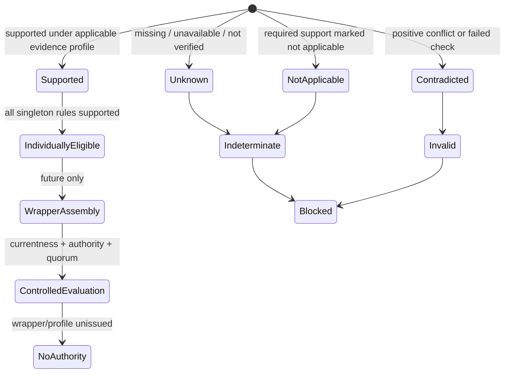

# Human Decision Assurance

Status: unissued Gate A architecture candidate, 2026-07-19. The contracts,
fixtures, and checks described here are architecture evidence only. They do
not establish a real human ceremony, satisfy a human-only authority slot,
complete consumer migration, accept Gate A, or authorize runtime work.

## Why this contract exists

A valid signature proves only that a signature verified under a declared key
and algorithm. A principal labelled `human` does not prove that a natural
person controlled the key, initiated this act, reviewed these exact bytes, or
made the stated Odeya decision. Authentication intent is also narrower than
substantive decision intent.

PRQ-013 therefore separates two subjects that must not be conflated:

1. the source decision, whose own schema and policy retain authority over its
   meaning, authorship fields, decision time, expiry, supersession, and effect;
2. one later ratification act in which one declared principal is asked to
   confirm the exact raw decision and candidate bytes that were reviewed and
   displayed.

One `HumanDecisionAssuranceCore`, one `HumanDecisionAssuranceEvidence`, and one
`HumanDecisionAssuranceSeal` represent exactly one such later act. They do not
aggregate principals. A future, separately identified `AssuredDecision`
wrapper must combine individual seals and evaluate currentness, expiry,
withdrawal, revocation, contradiction, authority, separation, and aggregate
quorum at a controlled evaluation time.

Missing or unknown required evidence is `indeterminate`, never false and never
approval. A positive contradiction is `invalid`. Timeouts and silence do not
become decisions.

## Nonrecursive construction

The generated challenge and evidence remain outside the Core whose exact bytes
they bind. No artifact digests itself.

```mermaid
flowchart LR
    D["Exact source decision bytes<br/>source schema retains meaning"]
    M["Exact candidate bytes"]
    C["Assurance Core<br/>one later-ratification request<br/>no challenge output · no self-digest"]
    H["RP/verifier challenge<br/>nonce ∥ SHA-256(exact frame)"]
    E["One Evidence record<br/>one participant observation<br/>exact crypto inputs + sanitized derived records"]
    S["One individual Seal<br/>candidate eligibility only"]
    W["Future AssuredDecision wrapper<br/>identity not assigned"]
    P["Controlled policy evaluation<br/>currentness · authority · quorum"]

    D --> C
    M --> C
    C -->|raw SHA-256 + bytes| H
    H --> E
    C -->|raw SHA-256 + bytes| E
    C -->|unchanged binding| S
    E -->|one exact raw binding| S
    S --> W --> P

    classDef current fill:#E0F2FE,stroke:#0369A1,color:#0C4A6E
    classDef later fill:#F1F5F9,stroke:#64748B,color:#334155,stroke-dasharray: 5 5
    class D,M,C,H,E,S current
    class W,P later
```



The current candidate includes:

- `HumanDecisionAssuranceCore` 0.1.0;
- `HumanDecisionAssuranceEvidence` 0.1.0;
- `HumanDecisionAssuranceSeal` 0.1.0;
- the exact `odeya-human-decision-challenge-frame-v1-candidate` binary framing
  profile and a separately retained deterministic recomputation vector;
- an exact, unissued singleton-eligibility ruleset whose total fail-closed law
  is byte-bound by the Seal and cross-checked by the retained candidate
  checker;
- a dedicated, schema-valid synthetic source decision whose exact candidate
  relation can be checked without reusing a historical operator decision; and
- a machine consumer census over the frozen pre-candidate schema corpus,
  command vocabulary, event vocabulary, decision families, and known missing
  contract nodes.

Raw SHA-256 is a T0 byte-binding mechanism, not canonical object identity. The
three schema resource IDs exist only as unissued candidates. No admitted
assurance-record or `AssuredDecision` wrapper identity exists, and every
migrated consumer requires a new identity behind the eventually accepted
canonical profile.

The framing graph is deliberately acyclic. The static framing profile contains
no Core, vector, Evidence, Seal, or self digest. The Core binds the profile's
exact raw SHA-256 and byte count; the separate vector evidence binds both
profile and Core bytes; Evidence then binds the Core; and the Seal binds the
Core plus one exact Evidence record. Moving the Core-dependent vector back
into the profile would create a mutual raw-digest cycle and is forbidden.

The Core is created before the ceremony. Its material bindings are therefore
requirements for what a later ceremony must display and review, not
observations that display, review, or confirmation already occurred. Only
Evidence may record those later observations.

## Source decision and later-ratification boundary

The retained positive chain uses
`tests/architecture-schema/fixtures/human-decision-assurance-decision-subject.valid.json`,
a dedicated
synthetic `operator-architecture-decision` record. It is a non-acceptance
decision over the retained synthetic candidate. The checker requires the
Core decision-subject artifact ID to equal the source record's `decision_id`.
It also requires the source decision's candidate manifest ID, version, and raw
digest to equal the Core's candidate subject and explicit subject
relationship.

The source decision's schema remains the semantic authority. The Core repeats
only relationship metadata that the checker requires to equal the exact source
record. It does not transfer or reinterpret policy-bearing decision value,
effect, implementation lock, expiry, supersession, or other semantic
authority. It binds the exact source record and its `/decision` pointer.

The fixture deliberately declares a source operator distinct from the later
confirming principal. The later confirmation therefore does not prove who
authored the source decision or that the source `decided_at` is true. It binds
only the later principal's ratification of the exact displayed and reviewed
decision and candidate bytes. `confirmed_at` is an assurance-ceremony time,
not a rewritten source-decision time.

The dedicated source decision, candidate, Core, Evidence, and Seal are
relationally coherent synthetic controls. They are not Daniel's decision, a
real display, a real review, or authority.

## Challenge and confirmation boundary

The challenge framing profile commits, in exact order, the Core schema
resource ID and exact Core-record raw digest, decision schema resource ID and
exact decision-record raw digest, candidate schema resource ID and exact
candidate-record raw digest, session, issue and expiry times, relying-party
ID, expected origin, and a 32-byte nonce. Each entry is length-prefixed; text
is exact ASCII, digests are decoded to 32 raw octets, and integers are unsigned
big-endian.

The resulting WebAuthn challenge is:

```text
nonce32 || SHA-256(exact_binary_frame)
```

It contains 64 raw bytes and is encoded as 86 base64url characters without
padding. `challenge_id` is the raw SHA-256 of those exact 64 challenge octets,
so another label cannot alias the same challenge.

The candidate pins all of the following:

- relying-party ID `odeya.danielwahnich.dev`;
- expected origin `https://odeya.danielwahnich.dev`;
- `navigator.credentials.get`;
- COSE algorithm `-7`, `ES256`, with substitution forbidden;
- at least 256 fresh random bits and a maximum 300-second lifetime;
- a half-open validity interval, issued-at inclusive and expires-at exclusive;
  and
- relying-party or independent-verifier generation with single, atomic
  consumption.

The checked chronology is:

```text
source-decision.decided_at = Core.source_declared_decided_at
  <= Core.created_at
  <= challenge.issued_at
  <= confirmation.confirmed_at
  <= challenge.assertion_received_at
  <= challenge.consumed_at
  < challenge.expires_at
```

An accepted assertion and the transition from prior-consumption count zero to
result-consumption count one must be one verifier-controlled atomic action.
An assertion observed exactly at expiry is late. Retry exhaustion, a timeout,
or a second consumer does not imply success.

The protected application confirmation is separate from the authenticator
gesture. Its `gesture_id` is the raw SHA-256 of the referenced exact sanitized
material-presentation and decision-confirmation receipt. That receipt asserts
the exact decision and candidate bindings and presentation identity; it is not
pixel evidence or proof of comprehension. The confirmation binds the assurance ID,
exact Core raw digest, session ID, challenge-request ID, content-derived
challenge ID, relying-party ID, expected origin, exact decision digest, and
exact candidate digest. Because it binds the whole Core, changing any Core
relationship or policy-request field requires a fresh confirmation; a checker
cannot silently rewrite the human act while rebinding test bytes.

This binding is no longer one-way. Under the
[ADR 0093](decisions/0093-co-bind-the-confirmation-gesture-through-a-two-phase-challenge.md)
two-phase construction, now adopted, the Core pins the v2 framing profile and
each participant observation carries a presentation challenge and a
confirmation receipt. The receipt commits backward to the presentation
challenge; the authentication challenge commits forward to the receipt digest
through three appended frame fields. The signature therefore covers the digest
of what was displayed and confirmed, and no artifact commits to a digest of
anything that commits to it.

The Gate A prerequisite
`confirmation_gesture_and_authenticator_actor_cryptographically_co_bound` is
therefore `true` — strictly as a property of the frame construction, re-derived
independently by the `challenge-frame` suite and re-checked against the Core
and Evidence bytes on every prerequisite run. It is not a measurement. No
ceremony occurred, so `material_presentation_receipt_verified_in_real_ceremony`
remains `false`, and the structured evidence, Seal, and candidate envelope
still retain
`confirmation_gesture_and_authenticator_actor_cryptographically_co_bound: false`
because those records state what an *observed* ceremony established, and this
fixture's ceremony is synthetic.

A presentation surface inside the trust boundary that fabricates its own
receipt is detected only when its receipt disagrees, never prevented. That
residue is the retained cost of declining the transaction-confirmation trusted
path at Gate A. Profile issuance remains blocked pending an independent
implementation, backing-byte dereference, end-to-end consumer refusal proof,
accountable review, and operator acceptance.

The retained vector proves only deterministic framing and recomputation. A
metamorphic second-nonce expected-pass control proves that the checker is not
hard-coded to the retained nonce. Neither synthetic control proves fresh
randomness, atomic storage, or a real ceremony.

## Evidence semantics

Each required observation is explicit:



The synthetic positive control exercises the `Supported` branch without
establishing real-world support.

The exact unissued ruleset applies a total precedence law. Any contradicted
required observation or failed required categorical condition is `invalid`.
Otherwise, any missing, `unknown`, or `not_applicable` required observation is
`indeterminate`; this candidate authorizes no `not_applicable` exception.
Only all-supported observations plus all-satisfied categorical conditions are
`eligible`.

`eligible` is not `approved`. It means only that this one synthetic act may
enter future `AssuredDecision` assembly. It does not state that the source
decision is current, unexpired, unwithdrawn, unrevoked, authoritative, or part
of a satisfied aggregate quorum.

The Core, Evidence, and Seal structurally require exactly one declared
principal act, one participant observation, one Evidence binding, and one
participant determination. Existing fields named `quorum_rule` and
`quorum_evaluation` are pinned to this singleton eligibility scope; they do
not perform aggregate quorum. More than one principal or Evidence record must
be represented by multiple individual chains and a future wrapper.

The Evidence schema deliberately admits `unknown`, `contradicted`, replayed,
and failed observations: those are facts that must remain representable. The
Seal schema is likewise a structural record, not a trusted evaluator. The
isolated semantic checker must dereference the exact bound candidate records,
recompute the singleton disposition, and reject an `eligible` seal whenever a
required observation is unknown, `not_applicable`, or contradicted. A
contradiction wins when it coexists with unknown support. Schema validity alone
is never eligibility.

The evidence set is role-addressed as well as ID-addressed. The checker
requires every expected role exactly once and resolves each
claim-bearing reference against that role. A client-data artifact therefore
cannot stand in for challenge generation, signature, custody, controlled time,
verifier, decision confirmation, or delegation/effective-control evidence.

The four inputs whose exact bytes feed cryptographic verification—client data
JSON, authenticator data, WebAuthn signature, and credential public key—use
`exact_unmodified_*` roles and
`byte_fidelity: exact_unmodified_cryptographic_input`. Their sanitation status
records a retention/content-policy review only; it never authorizes byte
transformation. The other eight entries are explicitly
`sanitized_derived_observation_record` values. Because this synthetic tranche
does not dereference the backing bytes, the checker verifies those labels and
relations, not actual byte fidelity.

The current fixture retains artifact IDs, roles, raw digests, byte counts, and
media types, but it does not dereference the backing artifact bytes.
Assignment, natural-person identity, custody, effective control, and verifier
independence are recorded as synthetic assertions under an unissued profile;
the candidate does not mechanically establish them. The checker can reject
internal inconsistency and role substitution, but it cannot upgrade those
assertions into real-world facts.

## Standards comparison

The candidate pins:

- [NIST SP 800-63B-4](https://csrc.nist.gov/pubs/sp/800/63/b/4/final),
  final July 2025, for authentication and authenticator assurance comparison;
  and
- [Web Authentication Level 3, Candidate Recommendation Snapshot,
  26 May 2026](https://www.w3.org/TR/2026/CR-webauthn-3-20260526/), for the
  relying-party ceremony comparison.

WebAuthn Level 3 is a Candidate Recommendation Snapshot, not a W3C
Recommendation. Neither source establishes Odeya decision meaning,
comprehension, cognition, natural-person identity by WebAuthn alone, exclusive
custody from a signature, delegation validity, effective-principal separation,
current authority, or aggregate quorum. Exact retained standard bytes,
conformance vectors, and an accepted Odeya profile remain open.

## Future `AssuredDecision` boundary

The individual Seal intentionally does not answer the consuming decision
question. A later wrapper must, at one controlled evaluation time:

1. resolve the exact source decision and all selected individual seals;
2. apply the source decision schema and consumer policy without copying or
   relabelling their semantics;
3. verify that each seal, its profile, and its supporting evidence remain
   current and applicable;
4. evaluate source expiry, supersession, withdrawal, revocation,
   contradiction, and correction state;
5. establish assignment, authority, authenticator, effective-control, and
   verifier-separation facts from accepted evidence rather than fixture
   assertions;
6. compute aggregate quorum over distinct authorized principals and effective
   control groups; and
7. atomically bind the evaluated frontier and resulting consuming transition.

That wrapper identity, schema, controlled-time policy, verifier substrate, and
consumer integration are not present in this tranche.

They also cannot precede their dependencies. T0 freezes only the
individual-assurance foundation candidate and exact census. T1 must construct
the `AuthorityAssignment` vertical contract, and T2 must construct the required
command, event, state, reducer, currentness, and quorum subjects before final
wrapper construction or consumer migration can claim dependency closure.

## Consumer migration boundary

The census found that the nine schemas originally named by ADR 0089 were only
a lower bound. The frozen source tree contains 19 direct or
policy-conditional decision-schema rows and nine pending
operator-acceptance-consumer rows, plus transitive command, event, registry,
projection, and constitutional consumers.

None is migrated in this tranche. Existing consumer schema bytes remain
unchanged. A later migration must:

1. assign new, separately identified, unissued consumer and `AssuredDecision`
   candidates without mutating retained IDs; only the exact Gate A operator
   decision can govern later issuance and admission;
2. require the exact wrapper at every applicable transition;
3. dereference the exact decision, candidate, individual seals, and accepted
   evidence;
4. evaluate currentness and authority at the consuming transition and fail
   closed for absent, stale, expired, withdrawn, revoked, contradicted,
   indeterminate, or invalid assurance;
5. reissue every command, event, persistence, and downstream contract that can
   admit or carry the decision; and
6. prove `PRQ-013-KB-001` is `invalid` at the consuming transition because its
   claimed human initiation is contradicted, not merely refused by the
   standalone assurance checker.

The current command and event catalogs still contain known missing typed
contract nodes. Those holes remain explicit census blockers and cannot be
interpreted as migration completion.

The checker pins the census inventories and reconciles their coverage counts.
Those classifications remain explicit ADR 0092 census judgments; this bounded
checker verifies their retention and arithmetic but does not independently
derive their semantic classification from source.

It additionally compares every baseline schema with the frozen Git checkpoint,
binds both the exact predecessor and deliberately amended
`docs/AUTHORITY_MATRIX.md` bytes, requires the current schema paths to equal the
exact baseline-plus-three-candidate disjoint union, and pins the
judgment-bearing classification, command/event partition, family, validator,
construction, completeness, migration, and nonclaim sections. The amended
matrix names only a future admitted `AssuredDecision` wrapper at an `H` slot and
records the exact contradiction-first `PRQ-013-KB-001` disposition. Those checks
prevent a coordinated census/hash edit from silently converting a candidate or
missing contract into admitted authority.

## Gate staging

Gate A evaluates the architecture: exact ceremony protocol, evidence schemas
and backing-byte rules, profile candidates, synthetic conformance vectors,
independent architecture-time verifier implementations, wrapper/consumer
contracts after their T1/T2 dependencies, accountable review, and the
operator's exact-byte decision. It does not require or authorize a live
ceremony, and the operator's Gate A decision is not evidence that the future
engine ceremony works.

After Gate A, one real protected ceremony may be separately authorized as a
bounded, disposable Gate B probe under the accepted profile. Agents receive no
credential or approval authority. Gate C remains responsible for any
implementation increment and its runtime identity, policy, isolation, replay,
and failure evidence.

## Retained nonclaims

- Synthetic fixtures are not human decisions, authentication evidence, or
  evidence that a natural person saw any bytes.
- The dedicated source fixture is relationally coherent but does not prove its
  declared operator, authorship, `decided_at`, or decision truth.
- Backing evidence artifact bytes are not dereferenced in the current
  synthetic chain.
- The application confirmation receipt and authenticator actor are not yet
  cryptographically co-bound; profile issuance requires a two-phase committed
  receipt or an accepted transaction-confirmation trusted path.
- The exact singleton ruleset is unissued and has no retained independent
  implementation; the current checker provides deterministic cross-checking
  only.
- Assignment, custody, effective control, verifier independence, and
  natural-person identity are asserted, not mechanically established.
- The candidate performs no aggregate quorum or consumer-currentness
  evaluation.
- Context-isolated model review is correlated review, not accountable or
  organizationally independent verification.
- A passing checker proves bounded agreement among retained candidate bytes;
  it does not prove the standards are implemented correctly.
- No current consumer accepts the assurance candidate.
- PRQ-013, T1, Gate A, runtime, deployment, scientific-results publication,
  spending, data access, and external effects remain blocked.
- `publication_authorized` in the candidate-evidence boundary means
  assurance-mediated scientific or product publication; it does not describe
  the separately governed architecture-repository release path.

The governing decisions are
[ADR 0089](decisions/0089-a-valid-human-signature-is-not-a-human-decision.md)
and
[ADR 0092](decisions/0092-bind-human-decisions-through-an-external-assurance-wrapper.md).
